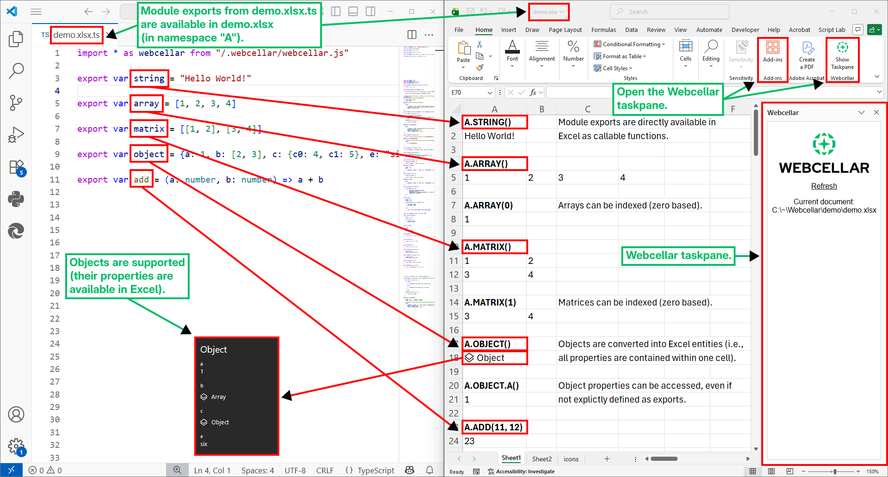

<picture align="center">
    <source srcset=".webcellar/github-header-dark.svg" media="(prefers-color-scheme: dark)">
    <source srcset=".webcellar/github-header-light.svg" media="(prefers-color-scheme: light)">
    
</picture>

**Webcellar** = **Web** technology (i.e., JavaScript) in Excel **cell**s.  

Note: Webcellar is currently experimental and depends on undocumented [Office.js](https://github.com/officedev/office-js) APIs. Furthermore, the current capabilities of Webcellar mainly reflect the needs of its developer (Acmeon), for example, it is only tested on Windows (although it might work on Mac). Nonetheless, Webcellar may prove useful for others as well.   


Demo (Annotated Screenshot)
-------------------------------------------

<picture align="center">
    <source srcset=".webcellar/screenshot-annotated-dark.svg" media="(prefers-color-scheme: dark)">
    <source srcset=".webcellar/screenshot-annotated-light.svg" media="(prefers-color-scheme: light)">
    
</picture>

Exports from `*.xlsx.js` (or `*.xlsx.ts`) files become automatically available in corresponding `*.xlsx` files as functions. By default, the exports are exposed under namespace **`A`** (as in **a**pplication or **a**dd-in) in Excel.

For a complete demo, run Webcellar (see the "Getting Started" section) and open `demo/demo.xlsx` in Excel. 

Getting Started
---------------

1. Install [Node.js](https://nodejs.org/) and [Microsoft Excel](https://www.microsoft.com/en-us/microsoft-365/excel).

2. Install Webcellar:
    ```
    npm install webcellar
    ```

3. Start Webcellar and define a directory (here the C drive, i.e., C:/) from which files are served (see the "Security" section for details):
    ```
    npx webcellar C:/
    ```

4. Webcellar will initialize itself on the **first run** by installing [Office.js](https://github.com/officedev/office-js) (a network connection is required), dependencies and certificates for a local HTTPS server. Answer the questions in the console, OK the dialogs and open the Webcellar taskpane in Excel (there should be a button for Webcellar in the Excel Home tab or under the Add-Ins button, see annotated screenshot in section "Demo (Annotated Screenshot)"). 

5. Exports from `*.xlsx.js` (or `*.xlsx.ts`) files are now available in  corresponding `*.xlsx` files as long as Webcellar is running. For a demo, open `demo/demo.xlsx` in Excel (assuming that it is under the C drive).

Alternatively, you can clone this repository, install the dependencies with `npm install` and start Webcellar with `node start.ts C:/`.


Differences Between Webcellar and an Office Add-In
--------------------------------------------------

The key differences between Webcellar and an Office Add-Ins (using the default configuration) for Excel are below.

1. Webcellar enables developers to define different JavaScript (JS) exports for different Excel files. Concretely, exports from `*.xlsx.js` (or `*.xlsx.ts`) files become available in corresponding `*.xlsx` files. In contrast, an Office Add-In defines the same JS functions for all Excel files, which may not always be appropriate. 

2. Webcellar automatically handles dimensionality and data type conversion between JS and Excel for developer convenience. For example, Webcellar automatically converts JS objects to Excel entities (see details in the "Dimensionality Conversion" and "Data Type Conversion" sections), Office Add-Ins often require manual conversion.

3. Webcellar runs entirely locally and offline after installation (i.e., no network external requests are required). Office Add-Ins depend on Office.js from Microsoft servers, thus, a network connection is required.

4. Webcellar disables external network requests by default (by way of a strict content security policy), which means that security risks of running untrusted code is reduced. By comparison, an Office Add-In allows external network requests.

5. Webcellar extracts function argument information directly from the JS source code (TypeScript annotations are utilized if they are available). Office Add-Ins require the use of JSDoc.

Note: Webcellar is an Office Add-In, thus, all capabilities of Webcellar could, in principle, be implemented in a Office Add-In. However, this is not the case by default.


Dimensionality Conversion 
--------------------------

Excel supports values whose dimensionalities are either "scalars" (i.e., single cell values) or "matrices" (i.e., ranges, where values are stored in multiple cells). This section documents the dimensionality conversion rules between JS and Excel.

The conversion rules from Excel to JS are below (these are applied, for example, when calling a JS function from Excel).

| Excel Dimensionality | JS Dimensionality |
| --- | --- |
| Scalar | Scalar |
| Row array | Array (one dimensional) |
| Column array | Array (one dimensional) |
| Matrix | Array of arrays |

Note: A standard Office Add-In converts Excel column arrays to JS arrays of arrays of length 1 (e.g., `[[1], [2], [3]]`). Webcellar deviates from a standard Office Add-In in this regard by converting both Excel row and column arrays to one dimensional JS arrays (i.e., there is no distinction between row and column arrays).  

All JS outputs are converted into matrices. This is a useful simplification, because JS must either output scalars or matrices. In other words, the common dimensionality is matrix (note that a scalar can be returned as a `1x1` matrix). The conversion rules from JS to Excel are below.  

| JS Dimensionality | Excel Dimensionality |
| --- | --- |
| Scalar | `1x1` matrix |
| Array (of length `n`) | `1xn` matrix (i.e., row array) |
| Matrix (array of `n` arrays of length `m`) | `nxm` matrix |

Note: Developers are unlikely to have to consider how JS dimensionality is converted into Excel dimensionality. For example, visually there is (seemingly) no difference between an Excel scalar and an Excel `1x1` matrix. The main difference is that in Excel, a reference to a cell (e.g., `A1`) that contains a `1x1` matrix can be referenced with `#` (e.g., `A1#`) to refer to the entire matrix. In contrast, scalars do not support this. 

Data Type Conversion
--------------------

All JS types are not supported in Excel. This section documents the data types conversion rules between JS and Excel. Note that the conversion rules are conditional on how Webcellar handles dimensionality conversion (i.e., scalars vs matrices; details in the "Dimensionality Conversion" section).

| JS Type | Excel Type |
| --- | --- |
| `string` | `string` |
| `number` | `number` |
| `boolean` | `boolean` |
| `array` | `array entity` |
| `object` | `object entity` |

An Excel entity (e.g., `array entity` and `object entity`) is, conceptually, an object with properties that is contained entirely within one cell. For example, the elements of an `array entity` are all stored in one cell, rather than in multiple cells on a row. In other words, an Excel `entity` is not, for example, a JSON string representation of a JS object.

Note: Due to how Webcellar handles dimensionality conversion, to directly output an `array entity` (i.e., not as an object property), you must wrap it in two arrays. For example, if the array is `[1, 2, 3]`, then to output it as an `array entity` return it as `[[[1, 2, 3]]]` (i.e., a `1x1` matrix).


Function Argument Types
-----------------------

Webcellar automatically extracts function argument information from JS source code and TypeScript (TS) annotations if they are available. This information is communicated to Excel primarily to limit calling functions with incorrect types. Default values for function arguments are currently not supported. 

Excel supports the following types (which directly correspond to their TS annotations): `string`, `number`, `boolean` and `any`. Other annotations (e.g., classes) are treated as `any`, which allows, for example, Excel entities.

If a function argument's TS type annotation ends with `[]`, then the dimensionality of the argument is matrix (note that `1x1` matrices are allowed). Otherwise, the dimensionality is scalar.

If a function argument has no annotation, then it is treated as `any` and its dimensionality is matrix. 

Note: Currently, type checks are performed **only** by Excel (i.e., Webcellar performs no type checks). Furthermore, object prototypes are not preserved when converting to Excel entities and back. Thus, runtime types may not always correspond to the annotations. Developers should implement additional type checks where needed.


Security 
--------

Excel files often contain sensitive data. Furthermore, execution of untrusted code often poses unnecessarily high security risks. In this context, Webcellar chooses to harden security by default. The key security principles are below.

1. External network requests are disabled with a strict content security policy, which helps prevent data leakage and execution of untrusted code.

2. The user must explicitly define the directories from which files are served (files in subdirectories are also served), which helps prevent data leakage.

3. Only files can be requested (e.g., there are no directory indexes), which limits file discovery.

4. Excel disallows taskpane navigation to external websites, which reduces the risk of executing untrusted code.

5. For each file that is served, the nearest (parent) Webcellar file (i.e., a `*.xlsx.js` or `*.xlsx.ts` file) must have been requested. This limits file exposure, because exact Webcellar file paths must be known upfront (note that for a given Excel file `*.xlsx` Webcellar automatically requests the corresponding `*.xlsx.js` or `*.xlsx.ts` file). Technically, authorization is stored in cookies. Examples of requests and outcomes for a given file structure are below.

    File structure (the `demo` directory of this repository):
    - bar/
        - bar.xlsx.ts
        - data.json
    - baz/
        - data.json
    - foo/
        - foo.xlsx.js
        - mod.js
    - demo.xlsx
    - demo.xlsx.ts
    - module.ts

    Requests and outcomes (cookies are assumed to be cleared between each list item):

    - `demo/demo.xlsx.ts` => **OK** (direct request to a Webcellar file).
    
    - `demo/module.ts` => **Fail** (nearest Webcellar file has not been requested).

    - `demo/foo/mod.js` => **Fail** (nearest Webcellar file has not been requested).

    - `demo/bar/data.json` => **Fail** (nearest Webcellar file has not been requested).

    - `demo/baz/data.json` => **Fail** (nearest Webcellar file has not been requested).

    - `demo/demo.xlsx.ts` => **OK** (direct request to a Webcellar file).  
      `demo/module.ts` => **OK** (nearest Webcellar file has been requested).

    - `demo/module.ts` => **Fail** (nearest Webcellar file has not been requested, note that order matters).  
      `demo/demo.xlsx.ts` => **OK** (direct request to a Webcellar file).  
      
    - `demo/demo.xlsx.ts` => **OK** (direct request to a Webcellar file, this file directly imports `demo/foo/foo.xlsx.js`).  
      `demo/foo/mod.js` => **OK** (nearest Webcellar file has been requested indirectly).

    - `demo/demo.xlsx.ts` => **OK** (direct request to a Webcellar file).  
      `demo/bar/data.json` => **Fail** (nearest Webcellar file has not been requested).

    - `demo/demo.xlsx.ts` => **OK** (direct request to a Webcellar file).  
      `demo/baz/data.json` => **OK** (nearest Webcellar file has been requested).

    Note: Module fetch order should not be relied on. Thus, Webcellar simultaneously grants authorization to a requested Webcellar file and to other Webcellar files it statically imports.


Command Line Interface
----------------------

Command to run Webcellar server:
```
npx webcellar <dirs...> [--mode <mode>] [--content-security-policy-sources <sources...>]
```

Arguments and options:

- `dirs`: Directories (one or more) from which files are served (for example, use C:/ on Windows to grant access to all files under the C drive).

- `--mode <mode>`: Execution mode for Webcellar: 'init' initializes, 'run' starts the server, 'deinit' removes it; by default '', which executes 'init' (if needed) and then 'run'.

- `--content-security-policy-sources <sources...>`:  Additional sources for the Content Security Policy (CSP) default-src directive (allowed by default: 'self', blob:, data:, 'unsafe-inline', 'unsafe-eval').

For example, to serve files from the C and D drives and permit network requests to `example.com` and `jsonplaceholder.typicode.com`, execute:
```
npx webcellar --content-security-policy-sources example.com jsonplaceholder.typicode.com C:/ D:/
``` 

API Reference
-------------

### Meta

```ts
class Meta 
{
    input?: "convert" | "raw" = "convert"
    output?: "convert" | "raw" = "convert"
    
    // For references, see https://learn.microsoft.com/en-us/office/dev/add-ins/excel/custom-functions-json#functions (note: the type name is a placeholder)
    excel?: ExcelCustomFunctionMetadata
}
```

Class that holds metadata for JS module exports. The `input` and `output` properties can be used to enable (`"convert"`) or disable (`"raw"`) dimensionality and data type conversion (for details, see sections "Dimensionality Conversion" and "Data Type Conversion"). The `excel` property corresponds to [Excel Custom Function Metadata](https://learn.microsoft.com/en-us/office/dev/add-ins/excel/custom-functions-json#functions). Note that using the `excel` property overrides Webcellar default behavior.  

### meta
```ts
function meta(value: any, meta: Meta): void
```

Use this function to set metadata (`Meta`) for JS module exports. For example 
```ts
import * as webcellar from "/.webcellar/webcellar.js"

export function timestamp(utc: boolean, invocation: CustomFunctions.StreamingInvocation<string>)
{
    var timer = setInterval(() => 
    {
        if(utc)
        {
            invocation.setResult(new Date().toUTCString())
        }
        else
        {
            invocation.setResult(new Date().toString())
        }

    }, 10000)

    invocation.onCanceled = () => 
    {
        clearInterval(timer)
    }
}

webcellar.meta(timestamp, 
{
    input: "raw",
    output: "raw", 

    excel: 
    {
        parameters: [{name: "utc", type: "boolean", dimensionality: "scalar"}],
        options: {stream: true},
        result: {dimensionality: "scalar"}
    }
})
``` 

### input
```ts
function input(value: any, root = false): any
```
Converts an Excel `value` to the corresponding JS value (for details, see sections "Dimensionality Conversion" and "Data Type Conversion"). If `root = true`, then `value` corresponds directly to a cell value, otherwise it is a property in an Excel entity. This function is automatically used if `Meta.input = "convert"`.

### output
```ts
function output(value: any, root = false): any
```
Converts a JS `value` to the corresponding Excel value (for details, see sections "Dimensionality Conversion" and "Data Type Conversion"). If `root = true`, then `value` corresponds directly to a root object, otherwise it is a property in an object. This function is automatically used if `Meta.output = "convert"`.

### initialize
```ts
async function initialize()
```
Initializes Webcellar and makes JavaScript module exports available in Excel. Automatically called by the Webcellar taskpane.

Notes
-----

Webcellar files (i.e., `*.xlsx.js` or `*.xlsx.ts`) require **no manual** build step, even if TS annotations are used. Technically, the TS annotations are erased on the client side by way of using [es-module-shims](https://github.com/guybedford/es-module-shims) and special handling of TS files. The Webcellar TS annotation eraser is custom built, because the eraser in [es-module-shims](https://github.com/guybedford/es-module-shims) is quite large (approximately 4.6 MB) and because function argument TS annotations are nonetheless processed (see section "Function Argument Types"). Thus, there may be some TS syntax that is not correctly erased.  

Data is serialized when communicating between Excel and JS, which may cause issues with performance.

